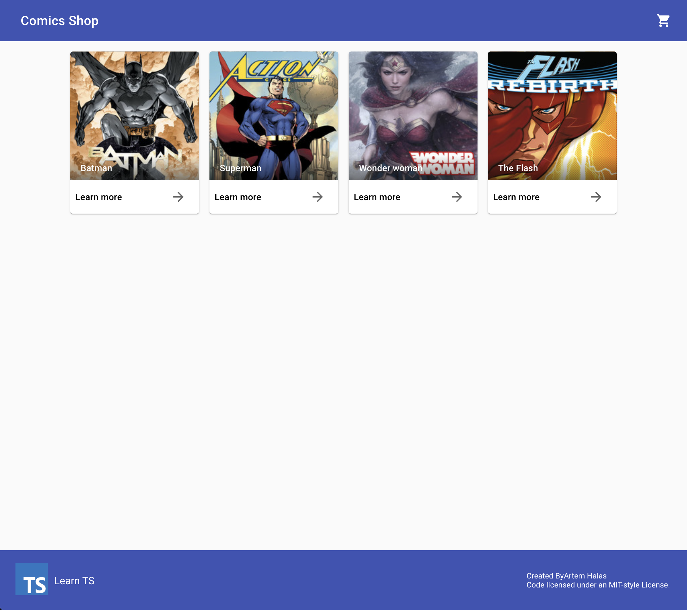
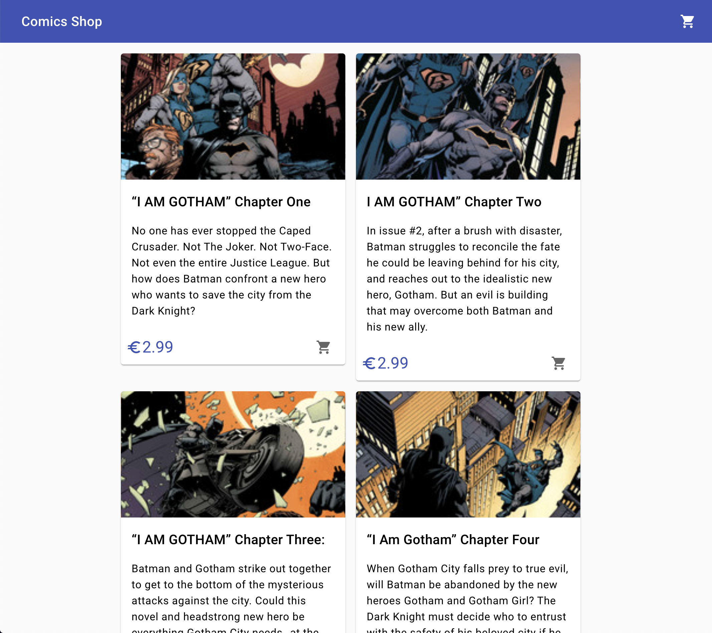

# Comics Shop UI
Simple Next.js application with Typescript and redux

Characters                 |  Comics
:-------------------------:|:-------------------------:
  |  

## Getting Started

- install dependencies
```bash
npm iinstall
# or
yarn
```

- run the development server:
```bash
npm run dev
# or
yarn dev
```

Open [http://localhost:3000](http://localhost:3000) with your browser to see the result.

## Technologies
- [Next.js](https://nextjs.org) - server side rendering
- [RMWC](https://rmwc.io/) - react material web component
- [Redux](https://redux.js.org/) - react state management
- [TypeScript](https://www.typescriptlang.org/)  - typed superset of JavaScript
- [Zeit](https://zeit.co/) - hosting
